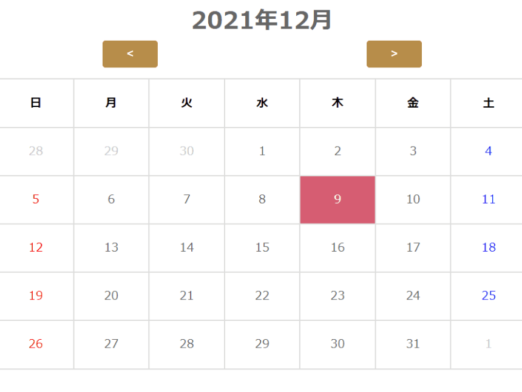

## 概要

PHPで作成した日記アプリです。

## 制作背景

日々の勉強の成果をどこかにメモしておきたいと考え、日記アプリの作成を行いました。

## 今後の改善点

- 日記を書きこんでいる日付は強調表示を行う。
- 認証機能を実装する。

## リンク

[こちら](https://github.com/nakamura0907/MyDiary)のリンクからリポジトリに飛ぶことができます。

