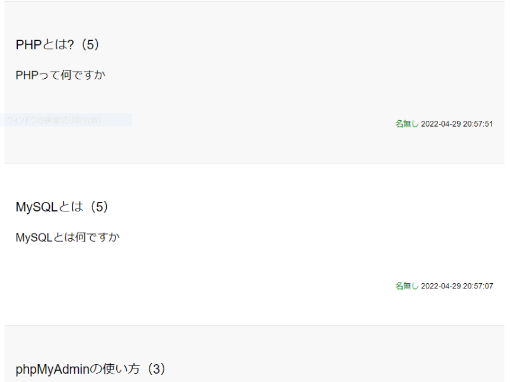

## 概要

PHPで作成した掲示板アプリです。

## 制作背景

プログラミングが上手くいかずスランプ状態に陥っていた時、初心に変えるため作成したアプリです。

単純なCR機能だけで作成ができるため、気楽な気持ちで作成ができました。 
今でもプログラミングが上手くいかないときは簡単な掲示板アプリを色々な言語で作成しています。

## 今後の改善点

- 〇〇チャンネルと同じような機能を実装する。

## リンク

[こちら](https://github.com/nakamura0907/BBS_PHP)のリンクからリポジトリに飛ぶことができます。
