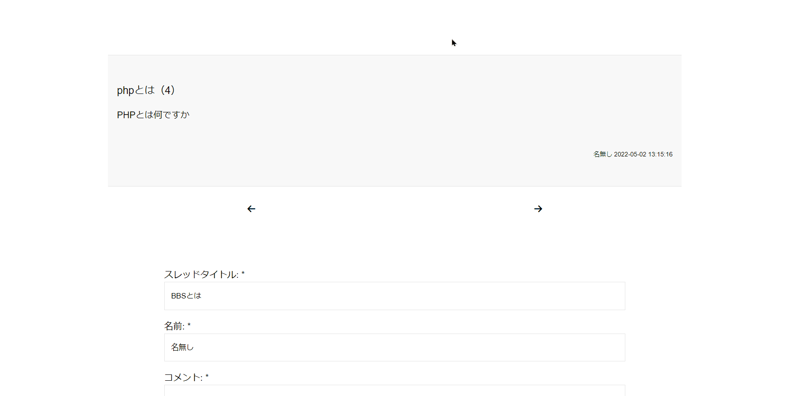
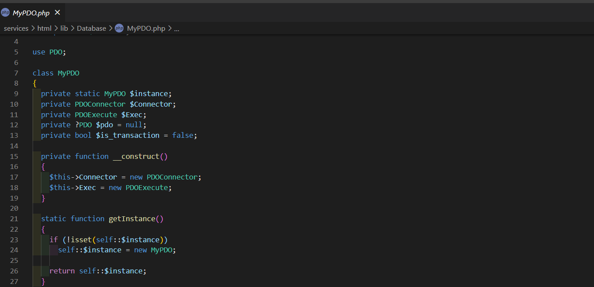

## 概要

PHPで作成した掲示板アプリです。

## 制作背景

オブジェクト指向とシステム開発のサイクルを勉強するために作成しました。

## 解説

複数回PDOの接続を行ってしまうのを防ぐため、PDOのラッパークラスにはシングルトンパターンを採用しました。

 

スレッドの投稿やコメントの取得など、アプリケーション固有の処理はアプリケーションクラスを作成してその中に閉じ込めました。

## 今後の改善点

- より最適なクラス設計を行う

## リンク

[こちら](https://github.com/nakamura0907/BBS_PHP)のリンクからリポジトリに飛ぶことができます。
