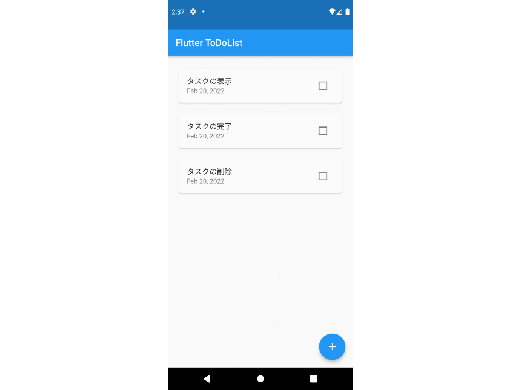

## 概要

Flutterで作成した端末内保存TodoListです。

## 制作背景

ストアでリリースされているモバイルアプリケーションを見てみると、機内モードにしていてもデータを保存できるアプリがたくさんあります。

そのような端末内に保存するアプリケーションの実装方法を勉強するために作成しました。

## 今後の改善点

- TodoListとしての機能をより充実させる。

## リンク

[こちら]()のリンクからリポジトリに飛ぶことができます。
