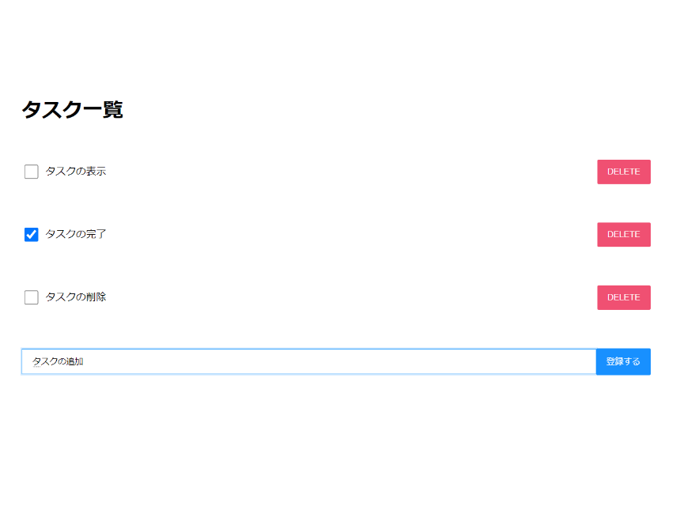

## 概要

Next.jsで作成したTodoListです。

## 制作背景

フロントエンドフレームワークの勉強を目的に作成しました。 
単一のページ内で頻繁にDOMの更新を行うTodoListはNext.js(React)を使うのが最適だと考えました。

## 今後の改善点

- TodoListとしての機能をより充実させる

## リンク

[こちら]()からリポジトリに飛ぶことができます。
