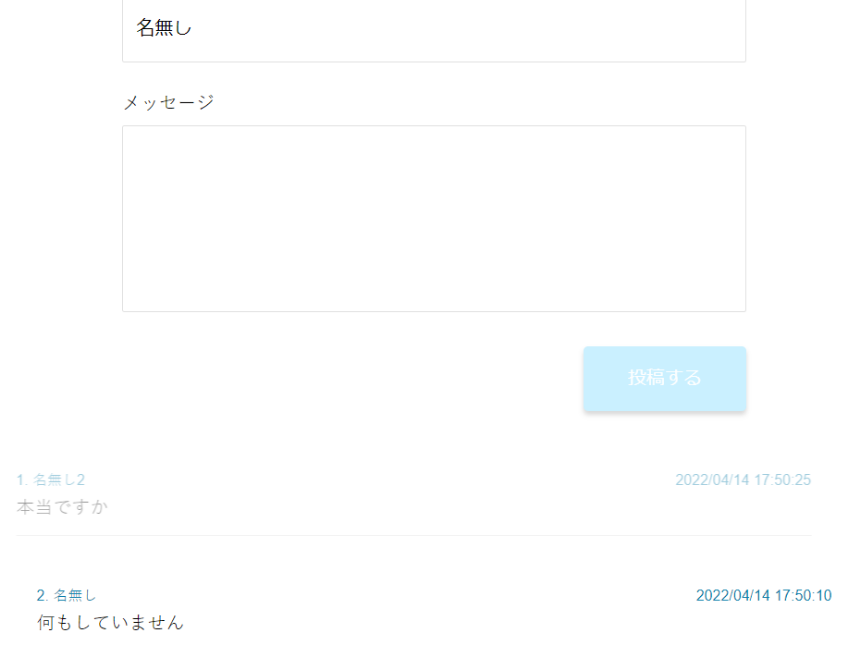

## 概要

Next.jsとSocket.ioを利用して作成した簡単なチャットアプリです。 
データベースを利用していないので、リロードなどを行うと消えてしまいます。

## 制作背景

システム開発に関しての本を読んでいると、よく「データベースを利用しないシステムはない」といった言葉を見かけます。

そこで、あえてデータベースを利用しないアプリを作ったらおもしろいのではないかと考え、このアプリを作成しました。

## 今後の改善点

- ファイルを送受信できるようにする。

機能面にまだまだ改善できる余地があるので、機能拡張を続けていきたいと思います。

## リンク

[こちら](https://nakamura0907.github.io/disappear-chat/public/index.html)のリンクからデモを試すことができます。
