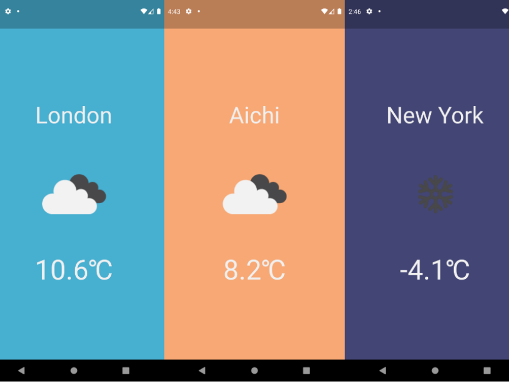

FlutterとWeather APIを利用したお天気アプリです

## 概要

FlutterとWeather APIを利用したお天気アプリです。 
現在地の天気を知ることができます。

## 制作背景

モバイルアプリケーションを開発してみたいと考えた時、一番はじめに浮かんだアイデアがお天気アプリでした。

APIを利用するだけで天気予報を取得でき、データベースを利用する必要がないので新たな言語の入門に最適だと考えました。

## 今後の改善点

- より詳細な天気予報を表示する。

## リンク

[こちら]()のリンクからリポジトリに飛ぶことができます。
