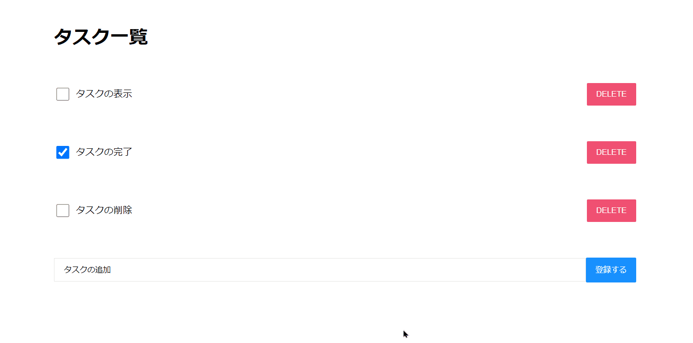

## 概要

Next.jsとPassport.jsで作成したTodoListです。

## 制作背景

ユーザー認証とフロントエンドの勉強を目的に作成しました。 
単一のページ内で頻繁にDOMの更新を行うTodoListはNext.js(React)を使うのが最適だと考えました。

## 解説

ユーザー認証・認可はPassport.jsのローカルストラテジーを利用しました。

## 今後の改善点

- タスク機能側のリファクタリングを行う
- Viewとロジックの分離を行う
- バリデーション機能の追加する
- 認証方法の種類を追加する
- パフォーマンスチューニングを行う

## リンク

[こちら](https://github.com/nakamura0907/to-do-next)からリポジトリに飛ぶことができます。
